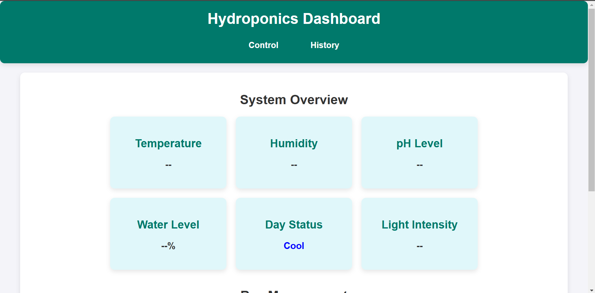
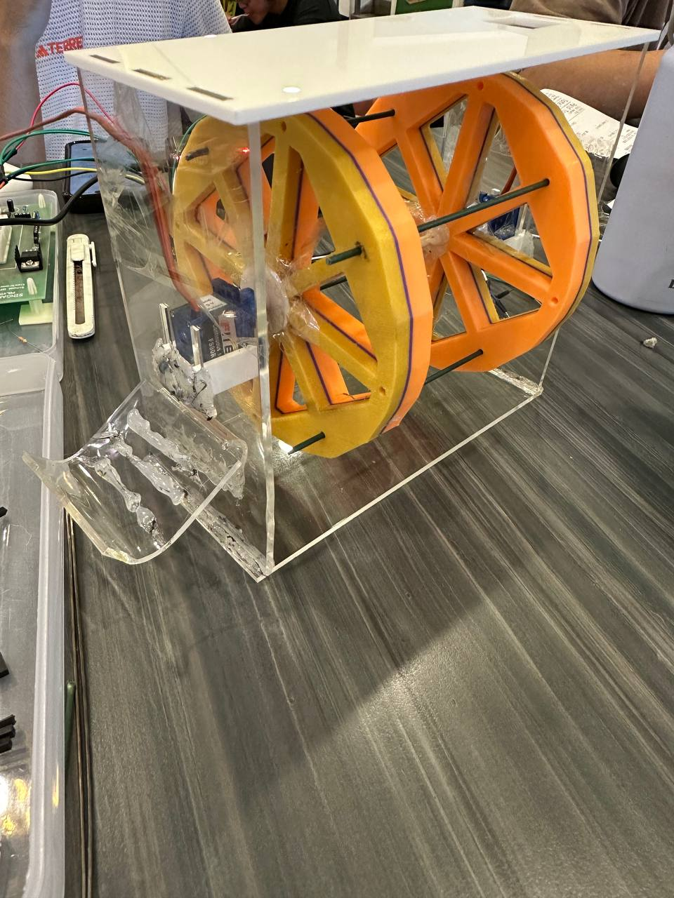

# Hydroponics Dashboard



This project provides a web-based dashboard for monitoring and controlling various environmental parameters in a hydroponic farming system. It uses Flask as a backend server and communicates with various sensors (e.g., temperature, humidity, light intensity) through a Raspberry Pi. The data from these sensors is collected via a serial connection and displayed on the dashboard in real-time.

## Features

- **🌡 Real-Time Monitoring**: View temperature, humidity, light intensity (Lux), and other system data.
- **📊 System Overview**: Check important parameters like pH level, water level, and pump status.
- **🌱 Bay Management**: Manage and track multiple plant bays, each with its own environmental settings and plant types.
- **🔄 Automated Data Updates**: The dashboard fetches updated sensor data every few seconds.
- **📱 User-Friendly Web Interface**: Responsive design with easy navigation.
- **🛠️ Remote Control**: Control system components such as water pumps, fans, and lights through the web interface. (Only Servo for now)
- **🔔 Alert System**: Get notified when sensor readings exceed predefined thresholds. (Only Buzzer to notify users currently)

## 📦 Setup Instructions

### Requirements

#### Hardware
- **Raspberry Pi** (any model with GPIO, serial and Wifi or Ethernet support)
- **Sensors**:
  - LDR (Light Dependent Resistor) for light intensity
  - DHT11/DHT22 for temperature and humidity
  - pH sensor
- **Actuators**:
  - LCD Display   
  - Servo motor
  - LED grow lights
  - Keypad

#### Software
- **Python 3.x**
- **Flask** (for backend server)
- **PySerial** (for communication with sensors)
- **SQLite3** (for local database management)
- **Flask-SocketIO** (for real-time updates)
- **HTML/CSS/JavaScript** (for frontend UI)

### 🚀 Installation

#### 1️⃣ Set Up Python Virtual Environment
Follow the Raspberry Pi documentation: [Python Virtual Environment Guide](https://www.raspberrypi.com/documentation/computers/os.html#python-on-raspberry-pi)

```bash
python3 -m venv hydroponics_env
source hydroponics_env/bin/activate
```

#### 2️⃣ Install Dependencies

```bash
pip install flask
pip install pyserial
pip install sqlite3
pip install flask-socketio
```

#### 3️⃣ Clone the Repository

```bash
git clone https://github.com/yourusername/hydroponics-dashboard.git
cd hydroponics-dashboard
```

#### 4️⃣ Run the Flask Application

```bash
python app.py
```

#### 5️⃣ Access the Dashboard

Open a web browser and go to:

```
http://localhost:5000
```

If accessing from another device on the same network, use the Raspberry Pi's IP address:

```
http://<raspberry_pi_ip>:5000
```

## ❌ Troubleshooting & Common Issues

### 🔹 Flask Application Not Running
- Ensure the virtual environment is activated before running the Flask app:
  ```bash
  source hydroponics_env/bin/activate
  ```
- Check for missing dependencies and install them again.

### 🔹 Serial Communication Issues
- Ensure the correct serial port is used in the Python script.
- Check if the required permissions are granted:
  ```bash
  sudo usermod -a -G dialout $USER
  ```
- Restart the Raspberry Pi if the issue persists.

### 🔹 Web Dashboard Not Loading
- Ensure Flask is running and the correct port is being used.
- Check if the firewall is blocking access:
  ```bash
  sudo ufw allow 5000
  ```

## 🔮 Future Enhancements

- **🤖 AI-Based Predictive Analytics**: Optimize plant growth using machine learning.
- **📱 Mobile App Integration**: Develop a mobile application for remote monitoring.
- **☁️ Cloud Data Storage**: Sync data with a cloud database for remote access.
- **💧 Automated Nutrient Distribution**: Enhance automation with controlled nutrient delivery.
- **👥 Multi-User Support**: Implement user authentication for different access levels.
- **💡 Pump and Light Control**: Manually or automatically control water pumps and grow lights.
- **🛠 First-Time Setup Wizard**: A guided setup process for configuring the hydroponics system.
- **⚙️ Sensor Threshold Configuration**: Set and adjust thresholds for different sensors to automate actions.


## 📝 License
Baby Licenses we don't have them sadly. I know we can make them but this project is honestly making me NUTS

## 👨‍💻 Contributors
- **Tony** (Project Lead)
- **Additional Contributors**
- **EHgitlab**
- **emmateoh14**

## 📩 Support
For issues and feature requests, please open an [issue](https://github.com/yourusername/hydroponics-dashboard/issues) on GitHub.

---

🚀 Happy Growing! 🌱

